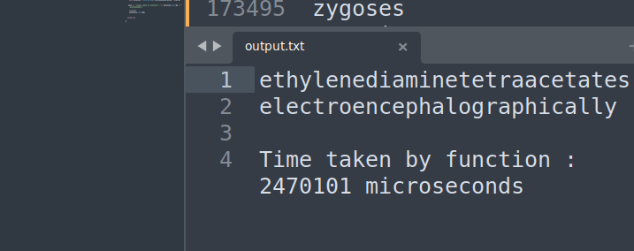
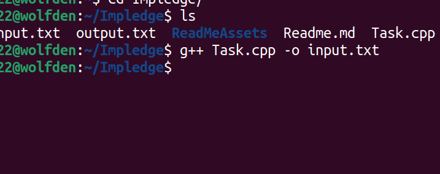

# Impledge Coding Question

### word composition problem 
    ``` 
    need to find the longest and second longest word that can be formed using smaller words
    Approch - Trie/prefixCheck traversal
    - the idea was to find the index of the word in the trie and its subtring 
    - note : if the ideal substring is not found it'll return -1 
    -then run a prefix checker on it to find the longest word
    - 
    ```

## Instructions to run

1. This code is  written in C++.
2.  To run this code, you need to have a C++ compiler and terminal.
3.  type the following command in the terminal
    ```bash
    g++ Task.cpp
    ./a.out
    ```
4.  The output will be displayed in the terminal.

## Output



## Example

### Input
    copy the entire input in the input.txt 
    or change the file name line 152
    ```cpp
      #ifndef ONLINE_JUDGE

    ifstream inputFile("input.txt");
    freopen("output.txt","w",stdout); 

    if (!inputFile.is_open()) {
        cerr << "Error opening the file." << endl;
        return 1;
    }

    #endif
    
    ```



